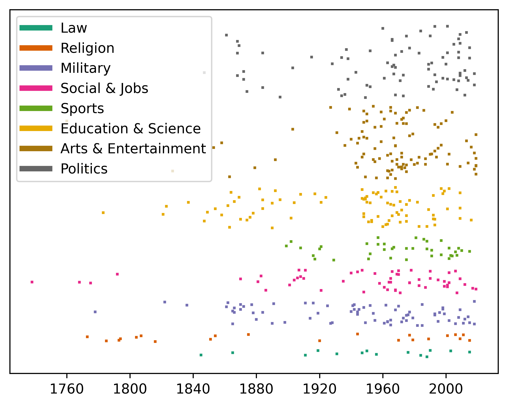

# African American Achievements

This example uses data
[collected from Wikipedia](https://github.com/rfordatascience/tidytuesday/blob/master/data/2020/2020-06-09/readme.md)
on African American "firsts" across a number of domains (e.g., the first
African-American owned-and-operated newspaper). In exploring this timeline,
we look at how the density of achievements changes over time within each of the
domains.

In looking at this plot, one of the first things we can see is an increase in
the density of achievements over time. However, we can also see some conspicuous
gaps. For example, there are no achievements in either Sports or Education &
Science from about 1930 through around 1950. This could suggest some historical
change or that there are achievements missing from our data set. Indeed, if we
look at the
[Wikipedia entry](https://en.wikipedia.org/wiki/List_of_African-American_firsts)
on which the data set was based, we can see that achievements in this time
period in these domains have been added since the data set was compiled in June
2020.

Finding these kinds of data quality and completeness issues is one of the
values of high touch exploratory data analysis.
