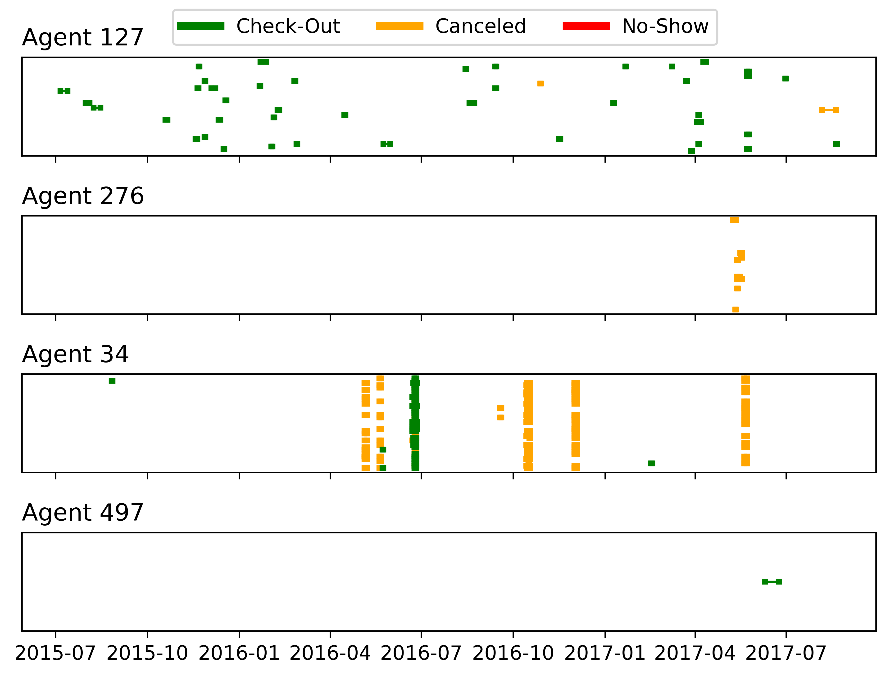

# Hotel Bookings

This example uses
[data on hotel bookings](https://github.com/rfordatascience/tidytuesday/blob/master/data/2020/2020-02-11/readme.md)
from
[Antonio, de Almeida, & Nunes, 2019](https://www.sciencedirect.com/science/article/pii/S2352340918315191).
The data show bookings at two hotels and include a number of features of the
bookings, including when the stay is scheduled to start and end, which agent
booked the hotel, and whether the guest kept the booking. Below, we explore the
booking behavior of four randomly selected agents: When were the booked stays
scheduled, and did the guests show?

The y-axis values of the bookings are assigned randomly to allow us to
distinguish overlapping bookings. The four agents show strongly variable
booking patterns. Agents 127 and 34 both made many bookings. However, Agent
127's bookings are scattered over the timeline, whereas Agent 34 seems to book
many reservations for the same times. Perhaps Agent 34 generally books for
corporate travel or conferences, and Agent 127 books personal travel. Also
notable is that Agent 276 and Agent 34 have *many* cancelations. Agent 497 just
has one long booking near the end of the data set. Either they are not a very
active agent, or they started booking shortly before the data set was compiled.

We can use this kind of exploration to generate hypotheses about the people in
the data set (like the one about Agent 34 being a corporate agent) that we can
share with stakeholders to validate / disconfirm to develop a deeper
understanding of our data.

By looking quickly at many plots of this type, we can also generate ideas
for the types of correlations we might observe in our data and to identify
features we might want to build into a model to predict, say, whether a booking
will be canceled. For example, we may want to include whether the booking
occurs at the same time as many other bookings from the same agent.
