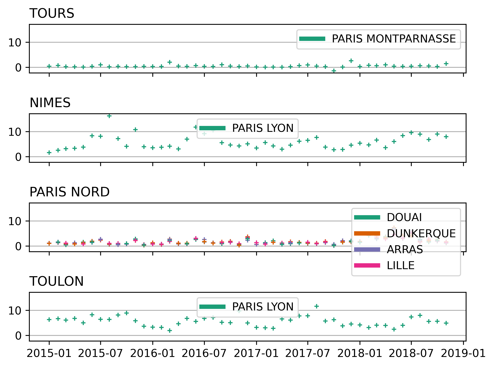

# Train Delays

This example uses
[data on delays for French train routes](https://github.com/rfordatascience/tidytuesday/blob/master/data/2020/2020-06-09/readme.md).
The data are aggregated by train route and month and contain information about
the departure station, arrival station, departure delay, arrival delay, the
number of trips, and the distribution of delay causes, among other variables.
For this exploration, we will look at departure delays (in minutes) for trains
leaving four randomly selected stations by their destination station.

We can see that the stations vary amongst themselves in their tendencies for
trains to leave late. Whereas passengers at Brest will typically leave on time
or only a minute or two late, passengers at the other stations will often leave
a few minutes or more late, even if they are headed to the same destination
(c.f., Le Mans). Nor does there seem to be a correlation between the departure
delays for trains leaving different stations headed to the same destination.
However, for Marne la Vallee, departure delays for both routes leaving from
this station seem positively correlated.

Together, these plots suggest that the departure station is, probably as
expected, more informative about departure delays than is the desintation
station. This could be further explored in the full data set. Discussion of the
*reasons* why this might be true with station owners, train operators, etc.
could be informative for model building.
